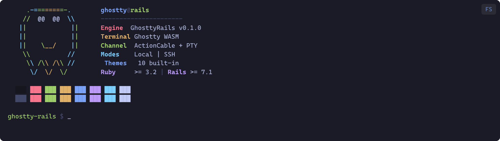

# GhosttyRails

A Rails engine that embeds a real terminal emulator in the browser using
[Ghostty](https://ghostty.org/) WASM, ActionCable, and Ruby's PTY module.
Supports local shell sessions and SSH connections with pluggable authorization
and SSH identity resolution.



## Table of Contents

- [Requirements](#requirements)
- [Installation](#installation)
  - [Ruby gem](#ruby-gem)
  - [JavaScript package](#javascript-package)
  - [Run the generator](#run-the-generator)
  - [Register Stimulus controllers](#register-stimulus-controllers)
  - [Add a route](#add-a-route)
- [Modes](#modes)
  - [Local mode](#local-mode)
  - [SSH mode](#ssh-mode)
- [Configuration](#configuration)
- [Authorization](#authorization)
- [SSH Identity Resolution](#ssh-identity-resolution)
- [Stimulus Controllers](#stimulus-controllers)
  - [TerminalController](#terminalcontroller)
  - [TerminalFullscreenController](#terminalfullscreencontroller)
  - [Wiring the two controllers together](#wiring-the-two-controllers-together)
- [Themes](#themes)
- [PTY Lifecycle and Resource Management](#pty-lifecycle-and-resource-management)
  - [How a PTY session is created](#how-a-pty-session-is-created)
  - [The read loop](#the-read-loop)
  - [Input and resize](#input-and-resize)
  - [Teardown and process cleanup](#teardown-and-process-cleanup)
  - [Concurrency and thread safety](#concurrency-and-thread-safety)
  - [Resource limits](#resource-limits)
- [Platform Support](#platform-support)
- [ActionCable Channel Name](#actioncable-channel-name)
- [Testing](#testing)
- [Development](#development)
- [License](#license)

## Requirements

**Server (Ruby):**

- Ruby >= 3.2
- Rails >= 7.1 (ActionCable required)
- A Unix-like server OS (Linux or macOS) -- see [Platform Support](#platform-support)
- `bash` available on `$PATH` (for local mode with default config), or configure
  an alternative shell
- `ssh` available on `$PATH` (for SSH mode)

**Client (browser):**

- Any modern browser that supports WebAssembly and WebSockets
- Works on Windows, macOS, Linux, iOS, and Android browsers

## Installation

### Ruby gem

Add to your `Gemfile`:

```ruby
gem "ghostty_rails"
```

Then:

```sh
bundle install
```

### JavaScript package

```sh
yarn add ghostty-rails
```

The npm package has the following peer dependencies, which your application must
provide:

- `@hotwired/stimulus` >= 3.0.0
- `@rails/actioncable` >= 7.0.0
- `ghostty-web` >= 0.4.0

### Run the generator

```sh
bin/rails generate ghostty_rails:install
```

This creates two files:

| File | Purpose |
| --- | --- |
| `app/channels/terminal_channel.rb` | Your app's channel subclass with authorization stubs |
| `config/initializers/ghostty_rails.rb` | Configuration block with commented defaults |

### Register Stimulus controllers

In your `app/javascript/application.ts` (or wherever you set up Stimulus):

```ts
import { Application } from "@hotwired/stimulus"
import {
  TerminalController,
  TerminalFullscreenController
} from "ghostty-rails"

const Stimulus = Application.start()
Stimulus.register("terminal", TerminalController)
Stimulus.register(
  "terminal-fullscreen",
  TerminalFullscreenController
)
```

### Add a route

```ruby
# config/routes.rb
get "terminal", to: "terminals#show"
```

## Modes

### Local mode

Opens a PTY on the server running your Rails app and spawns the configured shell
(default: `bash --login`). The browser user gets a live terminal session on the
server itself.

```html
<div data-controller="terminal"
     data-terminal-mode-value="local"
     data-terminal-auto-connect-value="true">
```

### SSH mode

Spawns an `ssh` process on the server that connects to a remote host. The
browser user interacts with the remote machine through the server as a relay.

```html
<div data-controller="terminal"
     data-terminal-mode-value="ssh"
     data-terminal-ssh-host-value="10.0.0.50"
     data-terminal-ssh-port-value="22"
     data-terminal-ssh-user-value="deploy"
     data-terminal-ssh-auth-method-value="key"
     data-terminal-auto-connect-value="true">
```

Supported auth methods: `key` (default) and `password`.

SSH parameters are validated server-side. Hosts containing shell metacharacters
(`;`, `|`, `&`, `` ` ``, spaces) are rejected to prevent command injection.
Ports outside 1--65535 fall back to 22.

## Configuration

In `config/initializers/ghostty_rails.rb`:

```ruby
GhosttyRails.configure do |config|
  # Shell command for local terminal sessions.
  # Must be an array of strings.
  # Default: ["bash", "--login"]
  config.default_shell = ["bash", "--login"]

  # TERM environment variable for PTY sessions.
  # Default: "xterm-256color"
  config.term_env = "xterm-256color"

  # Seconds to wait after SIGTERM before
  # escalating to SIGKILL.
  # Default: 3
  config.kill_escalation_wait = 3

  # Maximum scrollback buffer lines (sent to the
  # client-side terminal).
  # Default: 10_000
  config.scrollback = 10_000
end
```

If your server does not have `bash`, set `default_shell` to whatever is
available:

```ruby
config.default_shell = ["/bin/sh"]
```

Or to use the server user's configured login shell:

```ruby
config.default_shell = [
  ENV.fetch("SHELL", "/bin/sh"), "--login"
]
```

## Authorization

The generated `app/channels/terminal_channel.rb` subclasses
`GhosttyRails::TerminalChannel` and provides an `authorize_terminal!` hook.
Raise `GhosttyRails::UnauthorizedError` to reject the subscription:

```ruby
class TerminalChannel < GhosttyRails::TerminalChannel
  private

  def authorize_terminal!(params)
    unless current_user&.admin?
      raise GhosttyRails::UnauthorizedError
    end
  end
end
```

Connection-level authentication (who the WebSocket user is) is handled by your
`ApplicationCable::Connection` as usual. The `authorize_terminal!` hook is for
channel-level authorization (whether that user is allowed to open a terminal).

## SSH Identity Resolution

Override `resolve_ssh_params` to look up SSH credentials from your domain models.
Return a hash with `:identity` (path to a private key file) and/or `:user`:

```ruby
class TerminalChannel < GhosttyRails::TerminalChannel
  private

  def resolve_ssh_params(params)
    host = Host.find(params[:host_id])
    {
      identity: host.ssh_key_path,
      user: host.ssh_user
    }
  end
end
```

When `:identity` is returned, the SSH command includes `-o IdentitiesOnly=yes -i
<path>` so that only the specified key is offered. When it is absent, SSH uses
its default key discovery.

The `:user` from `resolve_ssh_params` is a fallback -- if the client sends a
non-empty `ssh_user` parameter, that takes precedence. If both are empty, the
user defaults to `root`.

## Stimulus Controllers

### TerminalController

Manages the Ghostty WASM terminal and ActionCable subscription.

**Targets:**

| Target | Required | Purpose |
| --- | --- | --- |
| `container` | Yes | DOM element where the terminal canvas is mounted |
| `content` | Yes | Wrapper whose background is set to match the theme |
| `page` | Yes | Outer page element for background color |
| `status` | Yes | Element for status/error text |
| `connectionForm` | No | Form shown before connection, hidden after |
| `connectBtn` | No | Button disabled during connection |
| `disconnectBtn` | No | Button to trigger disconnect |
| `subtitleActions` | No | Actions bar shown only when connected |
| `host` | No | SSH host input (SSH form mode) |
| `port` | No | SSH port input |
| `user` | No | SSH user input |
| `authMethod` | No | SSH auth method select |
| `password` | No | SSH password input |
| `passwordGroup` | No | Container for password field (toggled by auth method) |

**Values:**

| Value | Type | Default | Purpose |
| --- | --- | --- | --- |
| `mode` | String | `"local"` | `"local"` or `"ssh"` |
| `autoConnect` | Boolean | `false` | Connect immediately on mount |
| `channelName` | String | `"TerminalChannel"` | ActionCable channel class name |
| `savedTheme` | String | `"Tokyo Night"` | Theme name from the built-in set |
| `hostId` | String | `""` | Passed to server for `resolve_ssh_params` |
| `sshHost` | String | `""` | SSH host (auto-connect mode) |
| `sshPort` | String | `"22"` | SSH port (auto-connect mode) |
| `sshUser` | String | `"root"` | SSH user (auto-connect mode) |
| `sshAuthMethod` | String | `"key"` | `"key"` or `"password"` |

**Actions:**

| Action | Purpose |
| --- | --- |
| `connectTerminal` | Initiate a terminal session |
| `disconnectTerminal` | Tear down the session and show the form |
| `refitTerminal` | Re-fit the terminal to its container size |
| `changeAuthMethod` | Toggle password field visibility |
| `submitOnEnter` | Connect when Enter is pressed in a form field |

### TerminalFullscreenController

Toggles fullscreen overlay on the terminal wrapper.

**Targets:**

| Target | Required | Purpose |
| --- | --- | --- |
| `wrapper` | Yes | The element to make fullscreen |
| `btn` | Yes | Toggle button (gets `data-fullscreen-state` and `aria-label`) |
| `maximizeIcon` | No | Element shown when not fullscreen, hidden when fullscreen |
| `minimizeIcon` | No | Element shown when fullscreen, hidden when not fullscreen |
| `meta` | No | Metadata bar whose margin is adjusted |
| `terminalWrap` | No | Terminal container stretched via flex in fullscreen |

**Actions:**

| Action | Purpose |
| --- | --- |
| `toggle` | Enter or exit fullscreen |
| `handleKeydown` | Exit fullscreen on Escape |

**Dispatched events:**

The controller dispatches a `terminal-fullscreen:changed` event with
`detail: { fullscreen: true/false }` so other controllers can react.

**Customizing the fullscreen button:**

The controller does not ship any icons -- your app provides the button content. There
are two approaches:

*Option A: Icon targets (recommended for Lucide, Heroicons, SVGs, etc.)*

Place two elements inside the button and mark them as `maximizeIcon` and `minimizeIcon`
targets. The controller toggles their `hidden` attribute automatically:

```html
<button data-terminal-fullscreen-target="btn"
        data-action="terminal-fullscreen#toggle"
        aria-label="Enter fullscreen">
  <span data-terminal-fullscreen-target="maximizeIcon">
    <!-- Lucide "maximize" icon -->
    <i data-lucide="maximize"></i>
  </span>
  <span data-terminal-fullscreen-target="minimizeIcon">
    <!-- Lucide "minimize" icon -->
    <i data-lucide="minimize"></i>
  </span>
</button>
```

Both targets are optional. When absent, the controller still sets
`data-fullscreen-state` and `aria-label` on the `btn` target, so CSS-only approaches
continue to work.

*Option B: CSS with `data-fullscreen-state`*

The `btn` target receives `data-fullscreen-state="maximize"` or
`data-fullscreen-state="minimize"`. Use CSS attribute selectors to swap content:

```css
[data-fullscreen-state="maximize"] .icon-minimize,
[data-fullscreen-state="minimize"] .icon-maximize {
  display: none;
}
```

### Wiring the two controllers together

The terminal controller listens for the fullscreen controller's `changed` event
to refit the terminal after the layout changes:

```html
<div data-controller="terminal terminal-fullscreen"
     data-terminal-fullscreen-target="wrapper"
     data-terminal-mode-value="local"
     data-terminal-auto-connect-value="true"
     data-action="
       terminal-fullscreen:changed->terminal#refitTerminal
       keydown->terminal-fullscreen#handleKeydown"
     style="height: 600px;">

  <div data-terminal-fullscreen-target="meta"
       data-terminal-target="content"
       class="flex items-center justify-between mb-4">
    <h1>Terminal</h1>
    <div class="flex items-center gap-2">
      <span data-terminal-target="status"></span>
      <button data-terminal-fullscreen-target="btn"
              data-action="terminal-fullscreen#toggle"
              aria-label="Enter fullscreen">
        <!-- your icon here -->
      </button>
    </div>
  </div>

  <div data-terminal-target="page">
    <div data-terminal-target="container"
         data-terminal-fullscreen-target="terminalWrap"
         style="height: 100%; width: 100%;"></div>
  </div>
</div>
```

## Themes

The JavaScript package ships with ten built-in themes. Set the theme via the
`savedTheme` Stimulus value:

```html
<div data-controller="terminal"
     data-terminal-saved-theme-value="Dracula">
```

**Available themes:**

| Theme | Background |
| --- | --- |
| Tokyo Night (default) | `#1a1b26` |
| Catppuccin Mocha | `#1e1e2e` |
| Dracula | `#282a36` |
| Gruvbox Dark | `#282828` |
| Nord | `#2e3440` |
| Solarized Dark | `#002b36` |
| Catppuccin Latte | `#eff1f5` |
| GitHub Light | `#ffffff` |
| One Light | `#fafafa` |
| Solarized Light | `#fdf6e3` |

You can also import the theme data directly for custom use:

```ts
import {
  THEMES, DEFAULT_THEME, type TerminalTheme
} from "ghostty-rails"
```

Each `TerminalTheme` includes `background`, `foreground`, `cursor`, the standard
8 ANSI colors, and their bright variants, plus optional `selectionBackground`,
`selectionForeground`, and `cursorAccent`.

## PTY Lifecycle and Resource Management

Every terminal session creates a real operating system PTY and spawns a child
process (a shell or an SSH client). Understanding how these resources are managed
is important for production deployments.

### How a PTY session is created

When a client subscribes to the channel, `subscribed` runs:

1. **Authorization** -- `authorize_terminal!(params)` is called. If it raises
   `GhosttyRails::UnauthorizedError`, the subscription is rejected and no PTY is
   created.
2. **Validation** -- `valid_params?` checks that the mode is `"local"` or
   `"ssh"`, and in SSH mode validates the host, port, and auth method. Invalid
   params reject the subscription.
3. **PTY spawn** -- `PTY.spawn` is called with the shell command (either
   `config.default_shell` for local mode or an `ssh` command array for SSH
   mode). This allocates a Unix pseudo-terminal pair and forks a child process.
   `PTY.spawn` returns three values:
   - `@shell_read` -- the read end of the PTY (an `IO` object)
   - `@shell_write` -- the write end of the PTY (an `IO` object)
   - `@shell_pid` -- the PID of the child process
4. **Reader thread** -- A background `Thread` is started that continuously reads
   output from `@shell_read` and transmits it to the browser via ActionCable.

At this point the user has a live terminal session. One PTY, one child process,
one thread, and one ActionCable subscription per session.

### The read loop

The reader thread runs a tight loop:

1. Attempt a non-blocking 4 KiB read from the PTY read end.
2. If data is available, force-encode it as UTF-8 and transmit it as a
   `{ type: "output", data: "..." }` message over ActionCable.
3. If the read would block (`IO::WaitReadable`), wait up to 100 ms with
   `IO.select` and retry.
4. If the PTY is closed (`Errno::EIO` or `IOError`), break out of the loop.

After the loop exits, the thread reaps the child process
(`Process.waitpid` with `WNOHANG`) and transmits a `{ type: "exit" }` message to
the client.

### Input and resize

While the read loop runs on its background thread, the main ActionCable thread
handles incoming messages via `receive(data)`:

- **`type: "input"`** -- Writes the data string to `@shell_write`, which feeds
  it to the child process's stdin.
- **`type: "resize"`** -- Calls `@shell_read.winsize = [rows, cols]` to update
  the PTY dimensions, so the child process (and programs like `vim` or `htop`
  running inside it) can reflow their output.

All access to the PTY I/O objects is synchronized through a `@mutex` to prevent
races between the reader thread and the ActionCable message handler.

### Teardown and process cleanup

A session ends when the client unsubscribes (navigates away, closes the tab, or
calls `disconnectTerminal`) or when the child process exits on its own (the user
types `exit`). The cleanup sequence in `stop_shell` is:

1. **Set `@stopping = true`** -- Signals the reader thread to stop looping.
2. **Join the reader thread** -- Waits up to 5 seconds for it to finish.
3. **Close I/O** -- Both `@shell_read` and `@shell_write` are closed. Errors
   from already-closed descriptors are caught and logged.
4. **Terminate the child process:**
   - Send `SIGTERM` to the process group (`-pid`), falling back to the process
     itself if the group signal fails.
   - Poll with `Process.waitpid(pid, WNOHANG)` for up to
     `config.kill_escalation_wait` seconds (default: 3).
   - If the process has not exited, log a warning and escalate to `SIGKILL` on
     the process group.
   - Poll again for the same timeout.
   - Clear `@shell_pid`.

This ensures that:

- Child processes are not orphaned. Even if a user closes their browser without
  cleanly disconnecting, ActionCable fires `unsubscribed` and the full teardown
  runs.
- Processes that trap `SIGTERM` (or ignore it) are forcibly killed after the
  grace period.
- Process groups are signaled first, so child processes spawned by the shell
  (e.g., a long-running build) are also terminated.

### Concurrency and thread safety

Each terminal session uses:

- **1 ActionCable subscription** (managed by the ActionCable worker pool)
- **1 background reader thread** (created in `start_shell`, joined in
  `stop_shell`)
- **1 Mutex** (`@mutex`) protecting all PTY I/O operations

The mutex ensures that `receive` (called on an ActionCable worker thread) and
the reader thread never access `@shell_read` or `@shell_write` concurrently. The
`@stopping` flag is checked at the top of each read loop iteration to allow
prompt shutdown.

### Resource limits

Each open terminal session holds:

- 2 file descriptors (the PTY pair)
- 1 child process
- 1 Ruby thread

In production, the number of concurrent sessions is bounded by:

- Your ActionCable connection limit
- The server's file descriptor limit (`ulimit -n`)
- The server's process limit (`ulimit -u`)
- Available memory for the Ruby threads and child processes

There is no built-in session limit in GhosttyRails. If you need to cap
concurrent terminals, enforce it in your `authorize_terminal!` hook:

```ruby
def authorize_terminal!(params)
  if TerminalSession.active.count >= MAX_TERMINALS
    raise GhosttyRails::UnauthorizedError
  end
end
```

## Platform Support

**Server OS:**

| Platform | Supported | Notes |
| --- | --- | --- |
| Linux | Yes | Primary target |
| macOS | Yes | Full support; PTY and process groups work natively |
| Windows | No | Ruby's `PTY` module is Unix-only |
| WSL | Yes | Runs as Linux |

The server must be a Unix-like system because the channel uses `PTY.spawn`,
Unix signals (`SIGTERM`, `SIGKILL`), and process groups. Windows servers
(including native Ruby on Windows) are not supported. Use WSL if you need to
develop on a Windows machine.

**Client OS:**

Any platform with a modern browser works. The client side is pure
JavaScript/WASM running in the browser -- there are no OS-specific dependencies.
Windows, macOS, Linux, iOS, and Android browsers are all supported.

**Shell requirements:**

The default local shell is `bash --login`. If `bash` is not available on your
server, configure an alternative:

```ruby
GhosttyRails.configure do |config|
  config.default_shell = ["/bin/sh"]
end
```

For SSH mode, the `ssh` command must be available on the server's `$PATH`.

## ActionCable Channel Name

By default the Stimulus controller subscribes to `"TerminalChannel"`. If your
app's channel subclass uses a different name (for example, namespaced under a
module), set the `channelName` value:

```html
<div data-controller="terminal"
     data-terminal-channel-name-value="Admin::TerminalChannel">
```

## Testing

The gem includes a MiniTest test suite. To run:

```sh
bundle exec rake test
```

When writing tests for your own channel subclass, use ActionCable's channel test
case:

```ruby
class TerminalChannelTest <
    ActionCable::Channel::TestCase
  tests TerminalChannel

  setup do
    stub_connection
  end

  test "rejects unauthorized users" do
    stub_connection current_user: build(:guest)
    subscribe(mode: "local")
    assert subscription.rejected?
  end
end
```

## Development

```sh
git clone https://github.com/menloparking/ghostty_rails.git
cd ghostty_rails
bundle install
yarn install
bundle exec rake test    # Ruby tests
yarn typecheck           # TypeScript type checking
yarn build               # Compile TS to dist/
```

## License

MIT. See [LICENSE.txt](LICENSE.txt).
